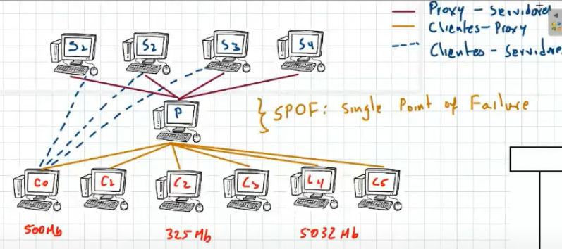
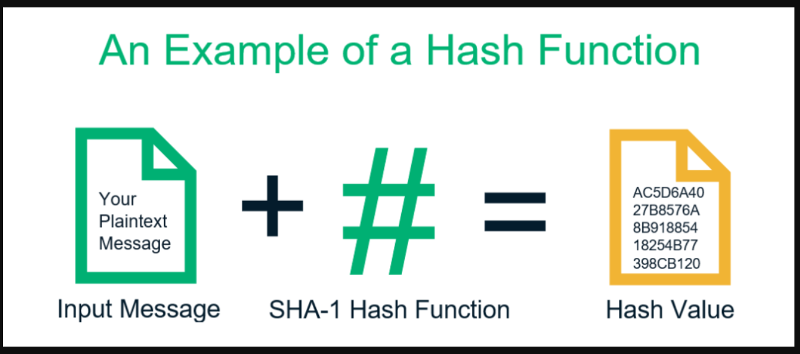
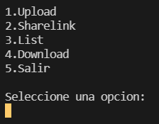
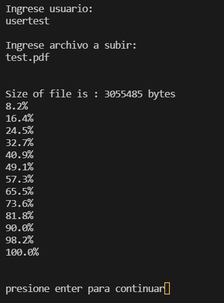

## File Server con Proxy y Servers

Programa tipo "google Drive" que corre un servidor que escucha uno o varios clientes y almacena archivos.

## Cluster de Servidores

Se implementan varios servidores que guardan los archivos por partes, hay un proxy que es el que redirecciona el tráfico a los servidores, Presentan la siguiente arquitectura

## Chunks: partes de archivo

El servidor recibe el archivo por partes para optimizar la memoria, al igual que la descarga del archivo también se hace por partes

## funcion de los hashes

se implementa la libreria hashlib para "encriptar" un archivo, básicamente es una función que recibe información (un archivo leido en binario por ejemplo) y lo convierte en un hash de 160-bits (20-bytes) sin importar el tamaño del archivo que se le pase

esto permite que si un usuario va a subir un archivo que el servidor ya tiene, no se guarda para evitar redundancia, es decir optimizar el almacenamiento

## Como usar el programa
  
- upload: sube un archivo al servidor
- list: lista los archivos subidos por un usuario o de todos
- sharelink comparte el link para descargar un archivo existente
- download: descarga el archivo solicitado al ingresar el link descarga del archivo correspondiente

---

Este programa se ejecuta corriendo varios archivos

- /Proxy/proxy.py
- /server1/server1.py
- /server2/server2.py
- /server3/server3.py
- /server4/server4.py
- /client/client.py

nota: Es importante ejecutar los archivos en ese mismo orden respectivamente

## Manejo de los archivos

para subir un archivo este debe estar en la misma carpeta de client.py

al subir un archivo en el servidor, se crea una carpeta ServerFiles que contine el archivo separado por partes

al descargar un archivo del servidor, se crea una carpeta Clientfiles donde se guarda el archivo solicitado

## Screenshots

