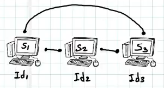

## File Server Sin Proxy

Continuando con el proyecto de servidores de almacenamiento ahora implementamos una lógica de servidores enlazados, que se apuntan entre sí el uno al otro, y manejan un "rango" de números el cual determina si procesan la solicitud de un cliente o lo delegan a otro servidor

## funcion de los hashes

se implementa la libreria hashlib para "encriptar" un archivo, básicamente es una función que recibe información (un archivo leido en binario por ejemplo) y lo convierte en un hash de 160-bits (20-bytes) sin importar el tamaño del archivo que se le pase

esto permite que si un usuario va a subir un archivo que el servidor ya tiene, no se guarda para evitar redundancia, es decir optimizar el almacenamiento

## Lógica del programa

Inicialmente tenemos varios servidores, los cuales generan un string o cadena de caracteres comprendida por:

### S= IP + MAC + PID + (100caracteres)

Este string lo hasheamos y luego lo convertimos a entero (hexa -> decimal)
este va a ser el rango que comprende las peticiones que podrá responder el servidor

## Ilustración de la arquitectura de los servidores

### Lógica de los servidores

### Rango de responsabilidad asignado

cada servidor se hace responsable de un rango de responsabilidad, un numero entre el cero y dos elevado a la 160 [0,2^160]

