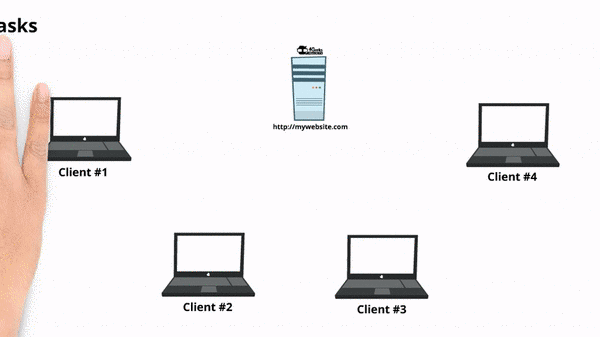

## File Server

Programa que almacena archivos tipo Google Drive, solo es necesario ejecutar el servidor y el cliente

```console
python client.py
```

```console
python server.py
```

Arquitectura cliente servidor donde se pueden ejecutar varios clientes y un servidor será capaz de atenderlos a todos

## Arquitectura


