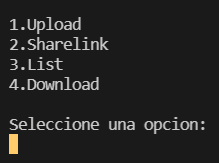

## File Server con chunks

Programa tipo "google Drive" que corre un servidor que escucha uno o varios clientes y almacena archivos.

## Chunks: partes de archivo

El servidor recibe el archivo por partes para optimizar la memoria, al igual que la descarga del archivo también se hace por partes

## Como Funciona
  
- upload: sube un archivo al servidor
- list: lista los archivos subidos por un usuario o de todos
- sharelink comparte el link para descargar un archivo existente
- download: al ingresar el link descarga el archivo correspondiente

---

Este programa se ejecuta corriendo dos archivos server.py  y client.py

Para correr el servidor ejecutamos

```bash
python server.py
```

Para correr el cliente ejecutamos

```bash
python server.py
```

## Screenshots

